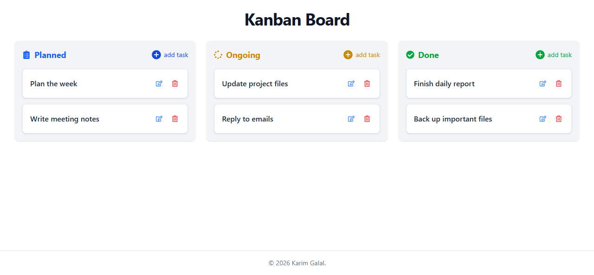
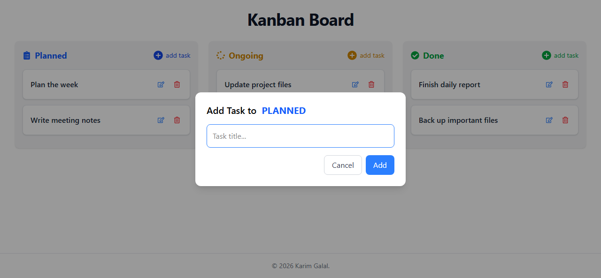
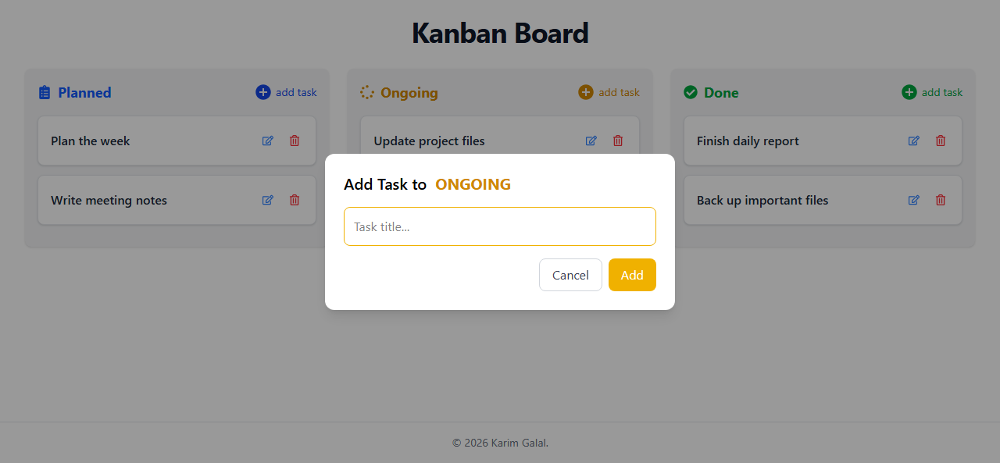
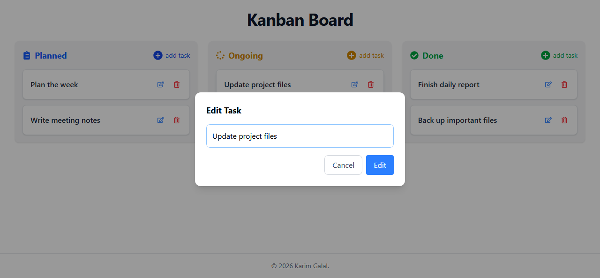
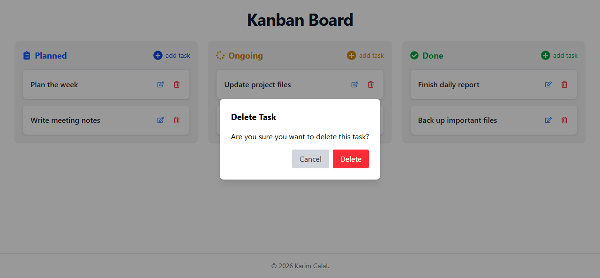
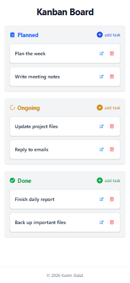

# Kanban Task Manager


React | Zustand | Tailwind | Vite

## Tech Stack

- React
- Zustand
- Tailwind CSS
- Vite
- Local Storage

A modern, responsive Kanban task management application built with React, Zustand, Tailwind CSS, and Vite.

The application allows users to create, edit, delete, organize, and persist tasks across multiple workflow stages using a clean drag-and-drop interface.

## Live Demo

Live demo: (https://kanban-task-manager-teal-psi.vercel.app/)

## Features

- Three-column Kanban workflow: Planned, Ongoing, and Done
- Add tasks directly to a selected column
- Edit existing task titles
- Delete tasks with a confirmation modal
- Drag and drop tasks between columns
- Persist tasks in local storage with Zustand middleware
- Keyboard support for modals:
  - `Enter` submits the active modal action
  - `Escape` closes the active modal
- Responsive layout for desktop, tablet, and mobile screens
- Column-specific colors and icons

## Screenshots

### Home



### Add Task Modal



### Add Task to Ongoing



### Edit Task Modal



### Delete Task Modal



### Mobile View



## Technologies Used

- [React](https://react.dev/)
- [Zustand](https://zustand-demo.pmnd.rs/)
- [Vite](https://vite.dev/)
- [Tailwind CSS](https://tailwindcss.com/)
- [React Icons](https://react-icons.github.io/react-icons/)
- [UUID](https://www.npmjs.com/package/uuid)
- [ESLint](https://eslint.org/)

## Folder Structure

```text
zustand_kanban/
src
 ├── components
 ├── modals
 ├── hooks
 ├── config
 ├── store
 └── App.jsx

docs
public

## Installation

Clone the repository and install dependencies:

```bash
git clone https://github.com/Karim-Galal/kanban-task-manager.git
cd zustand_kanban
npm install
```

## Usage

Start the development server:

```bash
npm run dev
```

Build the project for production:

```bash
npm run build
```

Preview the production build locally:

```bash
npm run preview
```

Run ESLint:

```bash
npm run lint
```

## Future Improvements

- Add task descriptions, due dates, or priorities
- Add task search and filtering
- Support reordering tasks inside the same column
- Add automated tests for store actions and modal behavior
- Add a dark mode option

## Why I Built This Project

This project was built to practice global state management using Zustand, reusable React components, modal management, drag-and-drop interactions, and local persistence with middleware.


## Acknowledgements

This project was inspired by a Zustand learning tutorial and was expanded with additional features, UI improvements, reusable components, and project structure enhancements as part of my learning journey.